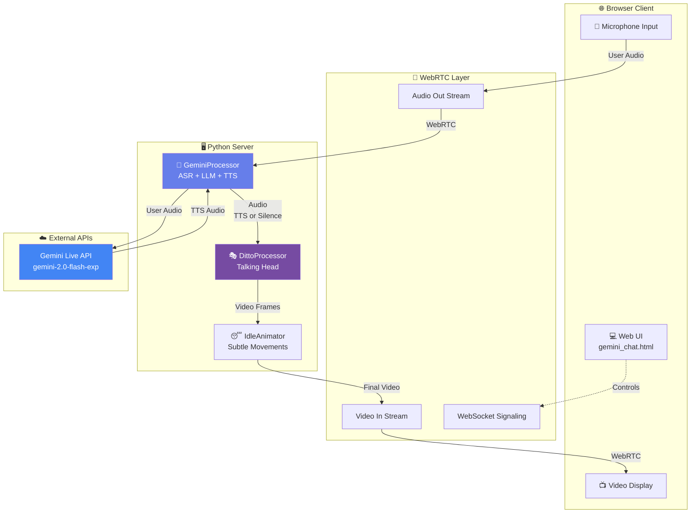
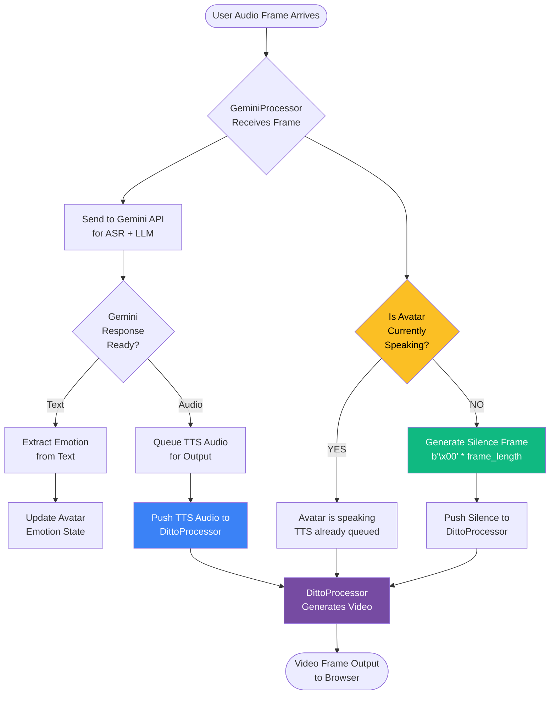
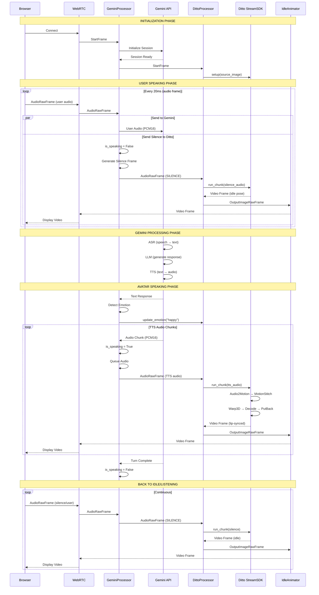
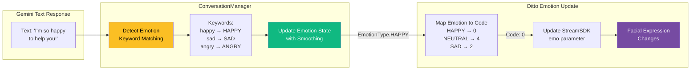
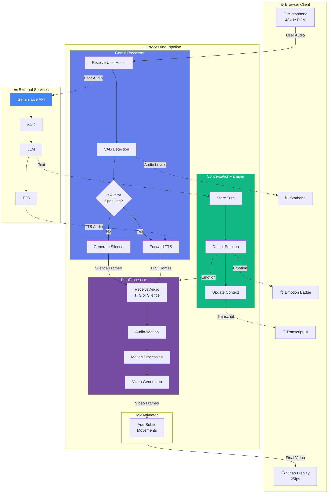

# Gemini + Ditto Architecture Flow Diagrams

## 1. High-Level System Architecture



## 2. Audio Flow Decision Tree



## 3. Three Audio States in Detail

```mermaid
stateDiagram-v2
    [*] --> Idle: Session Starts

    state "😴 IDLE STATE" as Idle {
        [*] --> NoAudio: No Input
        NoAudio --> SendingSilence: Continuous
        SendingSilence --> DittoIdle: Silence Frames
        DittoIdle --> IdleAnimation: Subtle Movements
        IdleAnimation --> [*]
    }

    state "👂 LISTENING STATE" as Listening {
        [*] --> UserSpeaking: User Audio Detected
        UserSpeaking --> ToGemini: Send to API
        UserSpeaking --> SendingSilence2: Also Send Silence
        SendingSilence2 --> DittoListening: Silence Frames
        DittoListening --> ListeningPose: Idle/Listening Pose
        ToGemini --> WaitingResponse: Processing
        WaitingResponse --> [*]
    }

    state "🗣️ SPEAKING STATE" as Speaking {
        [*] --> GeminiResponse: TTS Audio Ready
        GeminiResponse --> SendingTTS: Queue TTS
        SendingTTS --> DittoSpeaking: TTS Audio Frames
        DittoSpeaking --> LipSync: Lip-Synced Video
        LipSync --> CheckComplete{More Audio?}
        CheckComplete --> SendingTTS: Yes
        CheckComplete --> [*]: No
    }

    Idle --> Listening: User Starts Speaking
    Idle --> Speaking: Gemini Starts Speaking

    Listening --> Speaking: Gemini Responds
    Listening --> Idle: User Stops

    Speaking --> Listening: User Interrupts
    Speaking --> Idle: Speech Complete

    note right of Idle
        Audio to Ditto: SILENCE
        Avatar: Subtle idle movements
        VAD: No activity
    end note

    note right of Listening
        Audio to Ditto: SILENCE
        Avatar: Listening pose
        VAD: User detected
    end note

    note right of Speaking
        Audio to Ditto: GEMINI TTS
        Avatar: Lip-synced speech
        VAD: Avatar active
    end note
```

## 4. Detailed Pipeline Flow (Frame by Frame)



## 5. Emotion Detection and Update Flow



## 6. Interruption Handling Flow

```mermaid
flowchart TD
    Start([Audio Frame Arrives]) --> Process[GeminiProcessor<br/>Receives Frame]

    Process --> CalcVAD[Calculate Audio Level<br/>np.abs(audio).mean]

    CalcVAD --> CheckVAD{Audio Level ><br/>VAD Threshold?}

    CheckVAD -->|YES| UserSpeaking[is_user_speaking = True]
    CheckVAD -->|NO| UserSilent[is_user_speaking = False]

    UserSpeaking --> CheckInterrupt{is_speaking<br/>Avatar talking?}

    CheckInterrupt -->|YES| Interrupt[🚨 INTERRUPTION!<br/>is_speaking = False]
    CheckInterrupt -->|NO| Normal[Continue Normal Flow]

    Interrupt --> StopTTS[Clear TTS Queue]
    StopTTS --> SendSilence[Send Silence to Ditto]

    UserSilent --> CheckEndTurn{was_speaking<br/>before?}
    CheckEndTurn -->|YES| EndTurn[Send end_of_turn<br/>to Gemini]
    CheckEndTurn -->|NO| Continue[Continue]

    Normal --> SendSilence
    SendSilence --> Output([Output to Ditto])
    EndTurn --> SendSilence
    Continue --> SendSilence

    style Interrupt fill:#ef4444,color:#fff
    style CheckInterrupt fill:#fbbf24,color:#000
    style StopTTS fill:#f97316,color:#fff
```

## 7. Complete Data Flow with All Components



## 8. Audio Buffer Management

```mermaid
graph LR
    subgraph Input["Input Pipeline"]
        direction TB
        Browser[Browser Audio<br/>48kHz, 20ms chunks]
        Resample[Resample to 16kHz<br/>scipy.signal.resample]
        VAD[Voice Activity<br/>Detection]
    end

    subgraph GeminiQueue["Gemini Queue"]
        direction TB
        UserQ[User Audio Queue<br/>Send to Gemini]
        TTSQ[TTS Response Queue<br/>From Gemini]
    end

    subgraph DittoQueue["Ditto Queue"]
        direction TB
        AudioQ[Audio Queue<br/>Silence or TTS]
        Buffer[Buffer Management<br/>640 samples/chunk]
        Chunk[Chunking<br/>chunksize=(3,5,2)]
    end

    subgraph Output["Output Pipeline"]
        direction TB
        VideoQ[Video Frame Queue]
        Encode[H264 Encoding]
        Stream[WebRTC Stream]
    end

    Browser --> Resample
    Resample --> VAD
    VAD --> UserQ

    UserQ -.->|Network| TTSQ

    TTSQ --> AudioQ
    VAD -->|Silence when<br/>not speaking| AudioQ

    AudioQ --> Buffer
    Buffer --> Chunk
    Chunk --> VideoQ

    VideoQ --> Encode
    Encode --> Stream

    style VAD fill:#fbbf24,color:#000
    style AudioQ fill:#3b82f6,color:#fff
    style VideoQ fill:#764ba2,color:#fff
```

## Legend

- 🌐 Browser/Client components
- 🔌 WebRTC/Network layer
- 🤖 AI/ML processors
- 🎭 Video generation
- ☁️ External APIs
- 💬 User interface
- 📊 Monitoring/Stats

## Key Takeaways

1. **Audio Always Flows**: Ditto NEVER freezes because it always receives audio (TTS or silence)
2. **Three States**: Idle (silence), Listening (user speaks, silence), Speaking (Gemini TTS)
3. **Parallel Processing**: User audio → Gemini AND silence → Ditto (simultaneously)
4. **Emotion Integration**: Text responses trigger emotion detection → update Ditto expression
5. **Interruption Handling**: VAD detects user speech → stops avatar → switches to silence frames
6. **Frame Synchronization**: Audio chunks (40ms) → Video frames (25fps) maintained by StreamSDK

